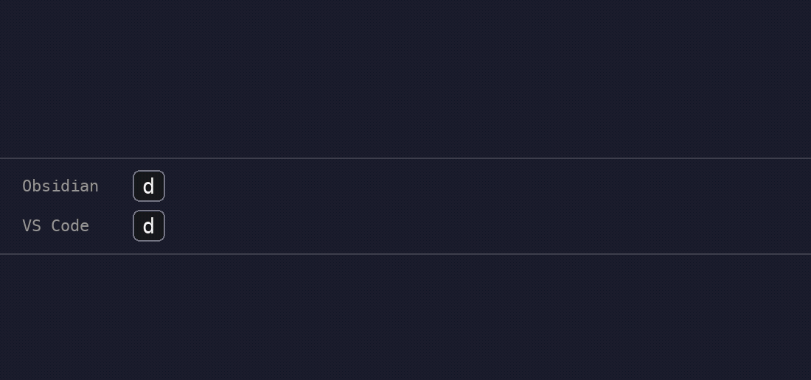

# snipsmith

a simple and powerful way to manage your latex snippets for obsidian, vscode, and neovim from a single source of truth



## what is this?

this project provides a unified system for managing your latex snippets. all your snippets live in a single, easy-to-read `snippets.yaml` file. a python script then compiles this file into the platform-specific formats required by obsidian-latex-suite, vscode's hypersnips extension, and neovim's luasnip. it's built to be flexible, allowing for platform-specific overrides, shared variables, and more.

## prerequisites

this project is built around these tools; you'll need the ones for your editors installed and configured to get started.

-   [obsidian-latex-suite](https://github.com/artisticat1/obsidian-latex-suite)
-   [hypersnips for vscode](https://marketplace.visualstudio.com/items?itemName=draivin.hsnips)
-   [luasnip for neovim](https://github.com/L3MON4D3/LuaSnip), with its `jsregexp` extra (see `install_jsregexp` in luasnip's readme)

## setup

in obsidian-latex-suite's settings:
-   enable `Load snippets from file or folder`
-   enable `Load snippet variables from file or folder`
-   take note of the file paths you choose for both of these settings

in vscode/cursor:
-   create empty `latex.hsnips` and/or `markdown.hsnips` files in your hypersnips snippets directory (for `.tex` and `.md` files)
-   take note of their file paths

in neovim:
-   pick a directory for lua snippet files (e.g. `~/.config/nvim/luasnippets/`) and load it in your config:

    ```lua
    require("luasnip").setup({
      enable_autosnippets = true,
      store_selection_keys = "<Tab>",
    })
    require("luasnip.loaders.from_lua").load({ paths = { "~/.config/nvim/luasnippets" } })
    ```

-   [vimtex](https://github.com/lervag/vimtex) is recommended for accurate math-context detection in latex files; without it the generated file falls back to treesitter

now, in the `.env` file in the root of this project, fill in the absolute paths you noted in the previous step. here's what your `.env` file should look like:

```
# .env file

OBSIDIAN_SNIPPETS_PATH="/path/to/your/obsidian/snippets.js"
OBSIDIAN_VARIABLES_PATH="/path/to/your/obsidian/variables.json"

# single path (for vscode only):
LATEX_SNIPPETS_PATH="/path/to/your/latex/snippets.hsnips"

# or multiple paths (for both vscode and cursor, for example):
LATEX_SNIPPETS_PATHS="/path/to/vscode/latex.hsnips,/path/to/cursor/latex.hsnips"

# neovim; filenames pick the filetype (tex.lua, markdown.lua):
NEOVIM_SNIPPETS_PATHS="/path/to/luasnippets/tex.lua,/path/to/luasnippets/markdown.lua"
```

## building snippets

assuming you have python 3 installed (you probably do), open your terminal and run

```
make snippets
```

this command will create a local python virtual environment, install the necessary dependencies, and generate your snippet files in the locations you specified. a canonical copy of every generated file is also written to the `build/` directory in this repo, so you can `git diff build/` to review exactly what changed before it goes live.

the build validates `snippets.yaml` first (unknown keys, invalid regexes, capture group references that don't exist, duplicate snippets, and more) and refuses to write anything if there are errors. to validate without writing any files, run

```
make check
```

ci runs the same validation on every push and also verifies that the committed files in `build/` match a fresh build, so behavior changes can't sneak in without showing up in a reviewable diff.

## cleaning up

to remove all generated files (at the paths specified in your `.env`) and the python virtual environment, simply run

```
make clean
```

that's pretty much it, enjoy! in the existing `snippets.yaml` i've provided the snippets i actually use in my setup, if that's useful. they're a combination of the default obsidian-latex-suite snippets, snippets from [here](https://github.com/Einlar/latex_snippets/blob/master/hsnips/latex.hsnips), and my own personal snippets.

## features

### regex vs plaintext triggers

by default, all snippet triggers are treated as plaintext. if you want a snippet to use a regex pattern trigger instead, add `regex: true` to the snippet definition:

```yaml
snippets:
  # this trigger is plaintext (default)
  - trigger: 'hello'
    replacement: "Hello, World!"
    options:
      text: true

  # this trigger is regex
  - trigger: '([a-zA-Z])bar'
    replacement: "\\bar{[[0]]}"
    regex: true
    options:
      math: true
```

**implementation details:**
- for obsidian: regex snippets include the `r` flag in options, plaintext snippets don't
- for vscode: regex triggers are wrapped in backticks (`` `trigger` ``), plaintext triggers are not
- plaintext triggers with spaces are automatically converted to escaped regex for vscode (since hypersnips doesn't support spaces in plaintext triggers)
- forward slashes in regex triggers are automatically escaped for obsidian (the snippet file is parsed as javascript, where triggers are `/.../` regex literals)

### capture groups in regex replacements

reference regex capture groups in replacements with obsidian-latex-suite's `[[n]]` syntax (`[[0]]` is the first capture group). the build script automatically translates `[[n]]` into hypersnips' inline javascript form (`` ``rv = m[n+1]`` ``) for vscode and into a luasnip function node (`snip.captures[n+1]`) for neovim, so one replacement works on all platforms:

```yaml
snippets:
  - trigger: ([a-zA-Z])und
    replacement: "\\underline{[[0]]}"
    regex: true
    options:
      math: true
```

you only need a `platforms.vscode.replacement` or `platforms.neovim.replacement` override when that platform's version genuinely differs from a mechanical translation.

### default options

set options once for all snippets in the top-level `defaults` section; individual snippets (and platform overrides) merge on top and can override any default:

```yaml
defaults:
  options:
    auto: true

snippets:
  # inherits auto: true
  - trigger: mk
    replacement: $$1$
    options:
      text: true

  # opts out (only triggers on tab)
  - trigger: ([a-zA-Z])dot
    replacement: "\\dot{[[0]]}"
    regex: true
    options:
      math: true
      auto: false
```

### in-word triggering

by default, snippets trigger inside words (`in_word: true`). this means `xsr` will expand to `x^{2}`, not just `x sr`. if you want a snippet to require word boundaries (only trigger after a space), set `in_word: false` in the snippet options.

### visual snippets

snippets with `${VISUAL}` in their replacement wrap selected text (obsidian and neovim). in obsidian, select text and type the trigger. in neovim, select text, press `<Tab>` (the `store_selection_keys` mapping from setup), then type the trigger.

### multiple output paths

you can export snippets to multiple destinations by specifying multiple paths in `LATEX_SNIPPETS_PATHS` (comma-separated): latex and markdown, both vscode and cursor, multiple vscode profiles. `NEOVIM_SNIPPETS_PATHS` works the same way (tex.lua and markdown.lua).

### platform-specific overrides

each snippet can have platform-specific overrides for obsidian, vscode, and neovim. this lets you customize triggers, replacements, or options per platform while keeping most of the snippet definition shared.

### shared variables

define variables once in the `variables` section and reference them in triggers and replacements using `{{VARIABLE_NAME}}`. the build script substitutes these automatically.
